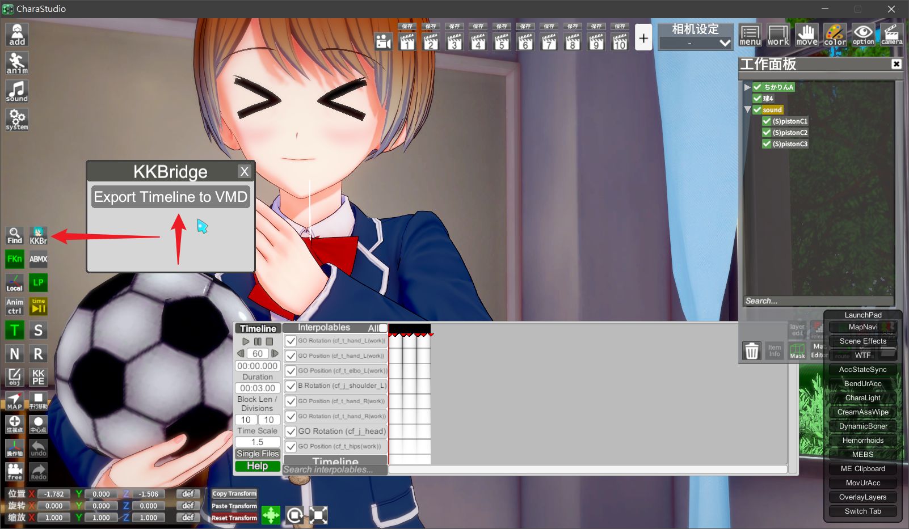
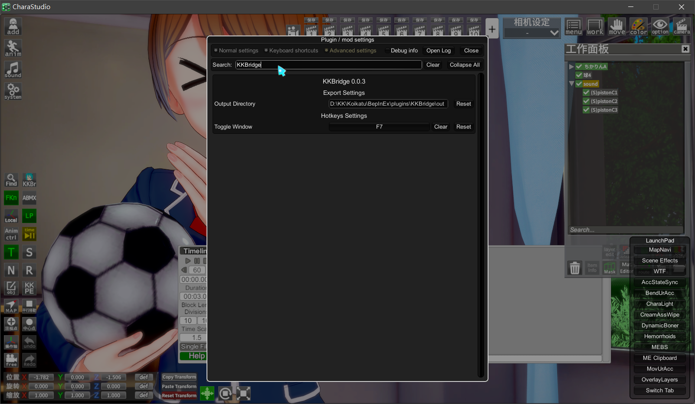

# KKBridge

Export Timeline animations to VMD format.

## Note

Use Koikatu instead of KoikatuSunshine for better stability. If you encounter issues with KoikatuSunshine, try Koikatu.

## Requirements

* Visual Studio 2022

## How to build

Build `src/KKBridge.sln` with Visual Studio.

## Dependencies

* BepInEx
* 0Harmony
* Timeline
* DLLs from Koikatsu
* SimpleJson

## License

This project is licensed under the MIT License. See the [LICENSE](LICENSE) file for details.

## Contributors

See <https://github.com/rintrint/KKBridge/graphs/contributors>

## Screenshots

