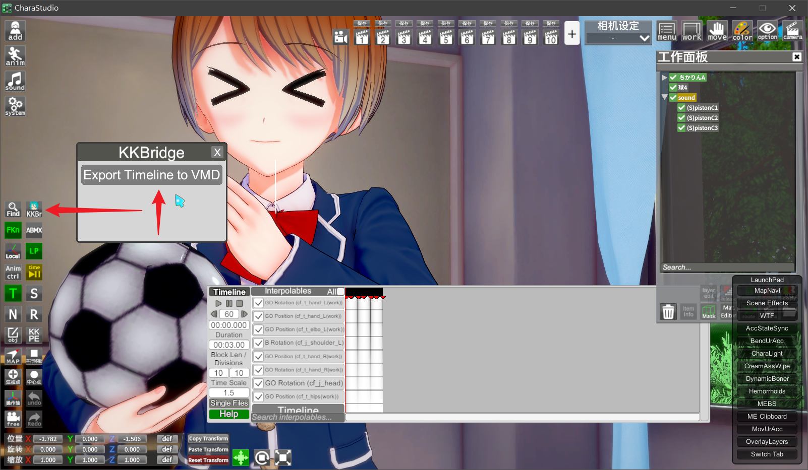
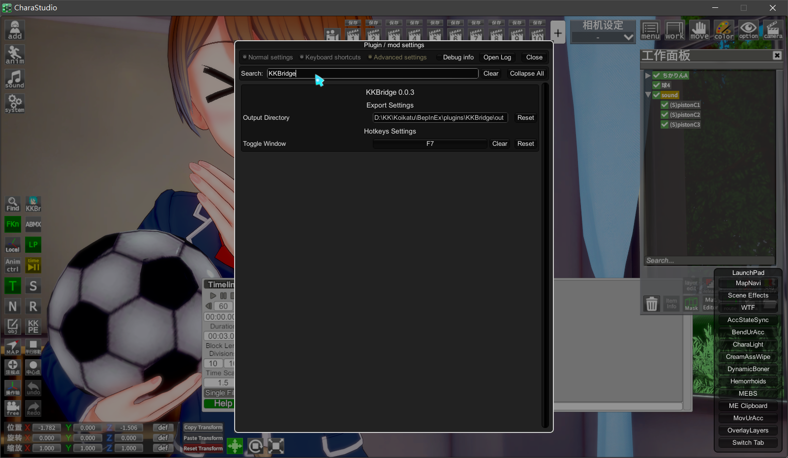
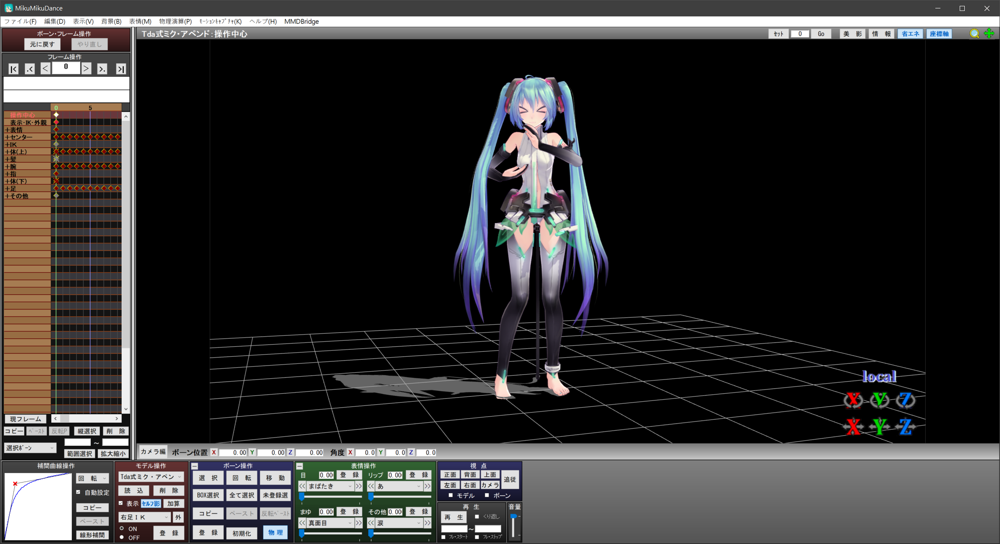
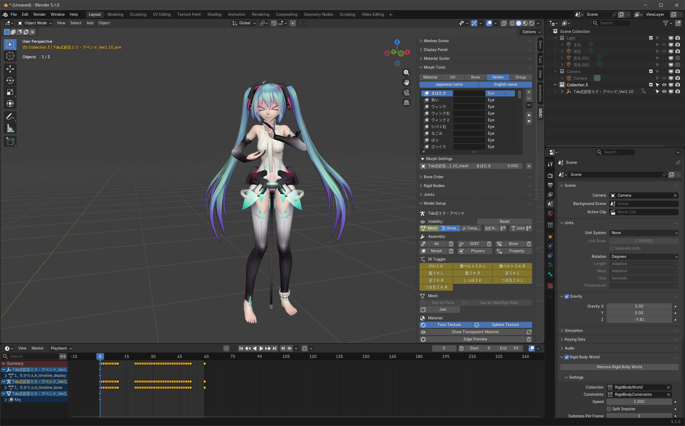

# KKBridge

Export Timeline animations to VMD format.

## Note

* Use Koikatu instead of KoikatuSunshine for better stability. If you encounter issues with KoikatuSunshine, try Koikatu.
* KKBridge is designed based on [Tda式初音ミク・アペンドVer1.10](https://bowlroll.net/file/4576). To prevent animation glitches, please make sure your model's bone structure is compatible with the Tda standard.

## Requirements

* Visual Studio 2022

## How to build

Build `src/KKBridge.sln` with Visual Studio.

## Dependencies

* BepInEx
* 0Harmony
* Timeline
* DLLs from Koikatsu
* SimpleJson

## License

This project is licensed under the MIT License. See the [LICENSE](LICENSE) file for details.

## Contributors

See <https://github.com/rintrint/KKBridge/graphs/contributors>

## Screenshots

